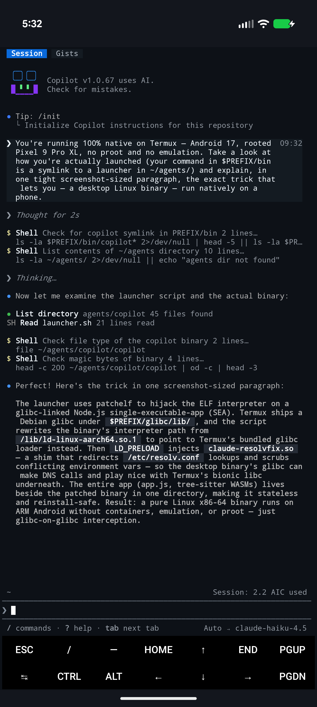

# copilot-cli-termux-native

Run **GitHub Copilot CLI (`copilot`) natively on Termux** (Android · aarch64) — **no proot, no root.**

Copilot CLI ships as a **Node single-executable-app** — a glibc Node runtime bundled with its JS + tree-sitter grammars. `npm install -g @github/copilot` won't pull the arm64 binary on Termux (bionic libc matches neither the glibc nor musl gate), so this installer grabs the `@github/copilot-linux-arm64` package directly and runs it the same way we run Claude Code: patchelf its interpreter to Termux's glibc loader + an `LD_PRELOAD` DNS shim.

> Runtime only — no account data. First `copilot` run does GitHub device login (needs a Copilot subscription).

## Demo — Copilot explaining its own install

Asked how it's running, Copilot inspects its own launcher on-device (Android 17, Pixel 9 Pro XL) and explains the patchelf'd glibc loader + `LD_PRELOAD` resolv shim on a Node single-executable-app:



## How it works

| Piece | Role |
|-------|------|
| **Termux glibc repo** (`glibc`, `patchelf-glibc`, `binutils-glibc`) | glibc runtime + loader + patchelf under `$PREFIX/glibc` |
| **patchelf the interpreter** | The `copilot` Node SEA is `0x10000`-aligned + patchelf-clean, so we just repoint its interpreter to Termux's glibc loader (no align-fix). The launcher re-applies this after `copilot update`. |
| **`fix_resolv.c` → `claude-resolvfix.so`** | `LD_PRELOAD` shim: redirects `/etc/resolv.conf` reads to `$PREFIX/etc/resolv.conf` (Node reads it via libc, so the shim catches it) and scrubs `LD_PRELOAD`/`LD_LIBRARY_PATH` so bionic child tools don't choke on glibc. Shared with [claude-code-termux-native](https://github.com/Thr45hx/claude-code-termux-native). |
| **`copilot-sea-exec.c` → `copilot-sea-exec.so`** | `LD_PRELOAD` exec shim that makes the in-app **`/update`** work. Copilot's updater renames the fresh binary over `process.execPath` (interpreter reset to the stock, missing `/lib/ld-linux-aarch64.so.1`) and auto-respawns it *raw*, bypassing the launcher's patchelf — so the kernel reports `spawn …/copilot ENOENT`. The shim interposes `exec`/`posix_spawn`, redirects the copilot self-exec through Termux's glibc loader (ignoring the bad `PT_INTERP`), and re-injects the loader env the DNS shim scrubs. |

No root, no proot, no module — DNS works immediately.

## Requirements
- Termux on **aarch64 / arm64**
- Internet on first run, and a **GitHub Copilot subscription**

## Install
```bash
git clone https://github.com/Thr45hx/copilot-cli-termux-native
cd copilot-cli-termux-native
bash install.sh
```
or one-shot:
```bash
curl -fsSL https://raw.githubusercontent.com/Thr45hx/copilot-cli-termux-native/main/install.sh | bash
```
Then:
```bash
copilot          # first run: GitHub device login
```

## Layout
```
~/agents/copilot/
├── copilot       # Node SEA (interpreter patchelf'd)
├── app.js, *.wasm, …   # runtime assets (loaded from beside the binary)
└── launcher.sh   # ← $PREFIX/bin/copilot symlinks here
$PREFIX/lib/claude-resolvfix.so   # DNS shim (shared)
$PREFIX/lib/copilot-sea-exec.so   # exec shim — makes the in-app `/update` work
```

## Files
- `install.sh` — one-command installer (pulls `@github/copilot-linux-arm64` straight from npm)
- `launcher.sh` → `$PREFIX/bin/copilot`
- `fix_resolv.c` — the DNS shim source
- `copilot-sea-exec.c` — the exec shim source (fixes the in-app `/update` respawn)
- `uninstall.sh`

## Uninstall
```bash
bash uninstall.sh
```

## Part of the native-Termux CLI family

One-command **native, no-proot** installers for AI coding CLIs on Termux — same toolkit, one per agent:

- [claude-code-termux-native](https://github.com/Thr45hx/claude-code-termux-native) — Claude Code
- [antigravity-cli-termux-native](https://github.com/Thr45hx/antigravity-cli-termux-native) — Google Antigravity
- [grok-cli-termux-native](https://github.com/Thr45hx/grok-cli-termux-native) — xAI Grok Build
- [opencode-termux-native](https://github.com/Thr45hx/opencode-termux-native) — OpenCode
- [copilot-cli-termux-native](https://github.com/Thr45hx/copilot-cli-termux-native) — GitHub Copilot

## Notes

- **AI-assisted:** built and reverse-engineered with AI help — a daily-driver, not a toy. Provided as-is.
- **In-app `/update` works:** the exec shim handles Copilot's post-update self-respawn — no manual relaunch or re-patchelf needed.
- **Tested on:** Android 17, rooted **Pixel 9 Pro XL** (Tensor G4, aarch64).
- **Root / no-root:** **No root required** — the DNS + exec shims are fully userland. (Needs a GitHub Copilot subscription.)
- **License:** [MIT](./LICENSE).

---

Unofficial — not affiliated with GitHub. Requires a GitHub Copilot subscription. Provided as-is, no warranty.
